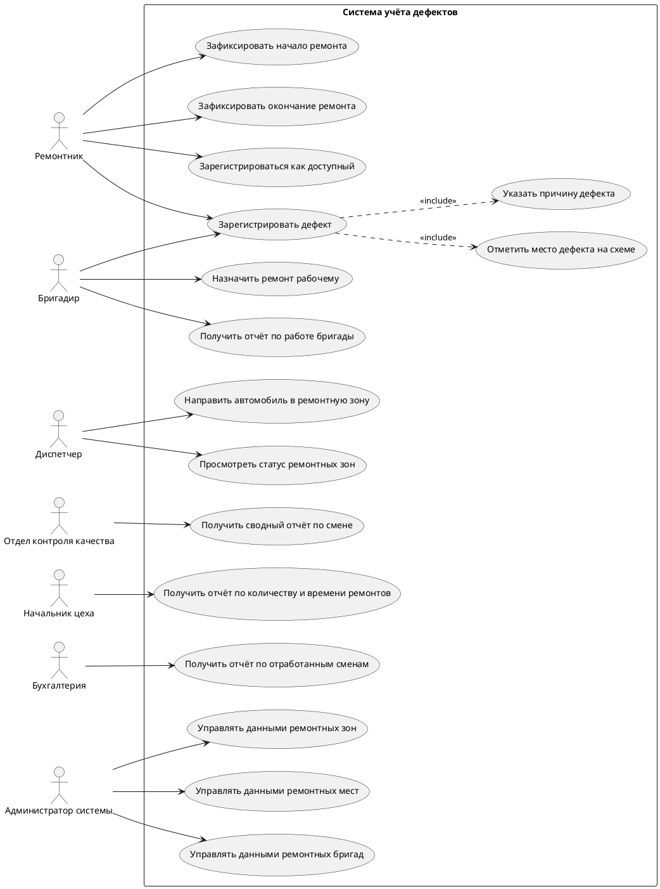

## Диаграмма случаев использования, описывающая пользователей и случаи использования разрабатываемого приложения

```plantuml
@startuml
left to right direction
skinparam packageStyle rectangle

actor "Ремонтник" as Mechanic
actor "Бригадир" as Foreman
actor "Диспетчер" as Dispatcher
actor "Отдел контроля качества" as QC
actor "Начальник цеха" as ShopManager
actor "Бухгалтерия" as Accounting
actor "Администратор системы" as Admin

rectangle "Система учёта дефектов" {
  usecase "Зарегистрироваться как доступный" as UC1
  usecase "Зарегистрировать дефект" as UC2
  usecase "Зафиксировать начало ремонта" as UC3
  usecase "Зафиксировать окончание ремонта" as UC4
  usecase "Назначить ремонт рабочему" as UC5
  usecase "Просмотреть статус ремонтных зон" as UC6
  usecase "Направить автомобиль в ремонтную зону" as UC7
  usecase "Получить сводный отчёт по смене" as UC8
  usecase "Получить отчёт по количеству и времени ремонтов" as UC9
  usecase "Получить отчёт по работе бригады" as UC10
  usecase "Получить отчёт по отработанным сменам" as UC11
  usecase "Управлять данными ремонтных зон" as UC12
  usecase "Управлять данными ремонтных мест" as UC13
  usecase "Управлять данными ремонтных бригад" as UC14
  usecase "Отметить место дефекта на схеме" as UC15
  usecase "Указать причину дефекта" as UC16
}

Mechanic --> UC1
Mechanic --> UC2
Mechanic --> UC3
Mechanic --> UC4

Foreman --> UC5
Foreman --> UC10
Foreman --> UC2

Dispatcher --> UC6
Dispatcher --> UC7

QC --> UC8

ShopManager --> UC9

Accounting --> UC11

Admin --> UC12
Admin --> UC13
Admin --> UC14

UC2 ..> UC15 : <<include>>
UC2 ..> UC16 : <<include>>

@enduml
```