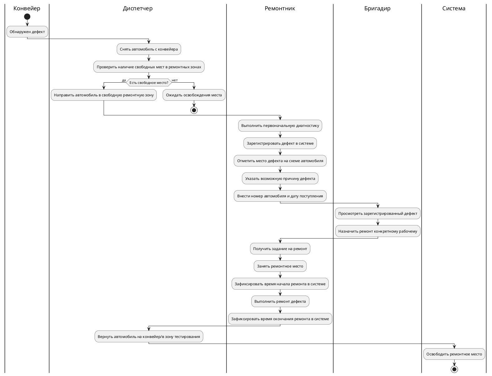

## Диаграмма активностей для основного бизнес-процесса, поддерживаемого приложением — регистрации и ремонта дефекта

```plantuml
@startuml
|Конвейер|
start
:Обнаружен дефект;

|Диспетчер|
:Снять автомобиль с конвейера;
:Проверить наличие свободных мест в ремонтных зонах;

if (Есть свободное место?) then (да)
  :Направить автомобиль в свободную ремонтную зону;
else (нет)
  :Ожидать освобождения места;
  stop
endif

|Ремонтник|
:Выполнить первоначальную диагностику;
:Зарегистрировать дефект в системе;
:Отметить место дефекта на схеме автомобиля;
:Указать возможную причину дефекта;
:Внести номер автомобиля и дату поступления;

|Бригадир|
:Просмотреть зарегистрированный дефект;
:Назначить ремонт конкретному рабочему;

|Ремонтник|
:Получить задание на ремонт;
:Занять ремонтное место;
:Зафиксировать время начала ремонта в системе;
:Выполнить ремонт дефекта;
:Зафиксировать время окончания ремонта в системе;

|Диспетчер|
:Вернуть автомобиль на конвейер/в зону тестирования;

|Система|
:Освободить ремонтное место;

stop
@enduml
```