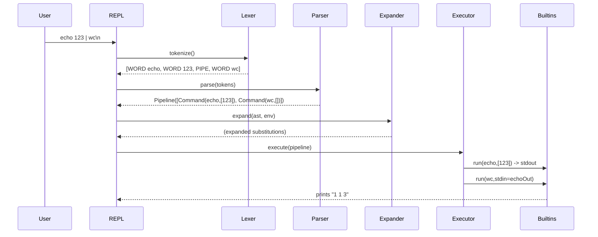

# software-design-itmo-course

## Команда

1. Синельников Максим
2. Малдыбаев Руслан Ашимович
3. Короткевич Леонид Витальевич
4. Батыров Амир Фанисович

## 1. Цели и область

Спроектировать минималистичный, расширяемый интерпретатор командной строки (CLI Shell), поддерживающий:

* **Команды (builtins):** `cat`, `echo`, `wc`, `pwd`, `exit`.
* **Кавычки:** одинарные (full) и двойные (weak) quoting.
* **Окружение:** присваивания `name=value`, подстановки через `$NAME`.
* **Вызов внешних программ**, если команда не является встроенной.
* **Пайплайны** через оператор `|` (конвейеры).

Нефункциональные требования:

* Простота добавления новых команд.
* Чёткое разделение ответственности между компонентами.
* Компонентная структура (не "клубок классов").
* Наличие текстового описания архитектуры и структурной диаграммы.
* Отражение **этапности** реализации (Фаза 1 → Фаза 2).

---

## 2. Высокоуровневая идея

Интерпретатор разделён на независимые слои:

1. **REPL** (ввод/луп): читает строку, отдаёт в пайплайн обработки, печатает результат/ошибки.
2. **Lexer/Tokenizer**: превращает исходную строку в токены (слова, кавычки, операторы, присваивания, пайпы).
3. **Parser**: строит **AST**/IR команды/конвейера (pipeline).
4. **Expander**: выполняет подстановки переменных и обработку кавычек, формируя окончательные аргументы.
5. **Executor**: исполняет AST: вызывает builtins или внешние программы, соединяет их потоками в пайплайне.
6. **Builtins Registry**: реестр встроенных команд с единым интерфейсом.
7. **Env**: абстракция окружения (get/set).
8. **IO/Pipes**: абстракция стандартных потоков и каналов (stdin/stdout/stderr, pipe).
9. **Errors & Diagnostics**: единый формат ошибок.

Такое разбиение позволяет:

* Менять/тестировать каждый компонент отдельно.
* Легко добавлять команды через регистрацию в реестре.
* Позже подключить расширения (алиасы, редиректы `>`, `<`, `>>`, и т.д.).

---

## 3. Модель данных (IR/AST)

### 3.1 Узлы AST

* **`Command`**: { `name: string`, `args: string[]`, `assignments?: Record<string,string>` }
* **`Pipeline`**: { `stages: (Command)[]` }

Assignments хранят присваивания, стоящие **перед** командой в качестве переменных окружения

### 3.2 Токены

`WORD`, `SQUOTE`, `DQUOTE`, `ASSIGN` (имя=значение), `PIPE` (`|`).

---

## 4. Диаграммы (Mermaid)

### 4.1 Последовательность (пример `echo 123 | wc`)



---

## 5. Правила лексинга и парсинга

### 5.1 Лексер

* Разбивает по пробелам вне кавычек.
* Распознаёт `|` как отдельный токен `PIPE`.
* Одинарные кавычки `'...'` - содержимое не интерпретируется (full quoting).
* Двойные кавычки `"..."` - разрешены подстановки `$VAR` (weak quoting), backslash-escape опционально.
* `name=value` в начале слова или перед командой - токен `ASSIGN`.

### 5.2 Парсер

```
command   := { assignment } WORD { argument } ;
pipeline  := (command|pipeline) | (command|pipeline) | ... ;
assignment:= NAME '=' VALUE ;
argument  := WORD | SQUOTE | DQUOTE ;
```

Где `WORD` может включать фрагменты с `$VAR` (обрабатываются позже на фазе expand).

---

## 6. Подстановки и кавычки (Expander)

* **Переменные:** `$NAME` → подстановка из `Env` или `LocalEnv`. Имя: `[A-Za-z_][A-Za-z0-9_]*`.
* **Одинарные кавычки `'...'`:** содержимое берётся как есть (никаких подстановок и экранирований).
* **Двойные кавычки `"..."`:** выполняются подстановки `$NAME`; сам символ `"` не входит в итоговый аргумент.
* **Конкатенация:** соседние лексемы склеиваются: `"$x"$y` → значение `x` + значение `y`.
* **Присваивания:** `VAR=VAL` без команды → изменить `LocalEnv`;

Ошибки подстановки (нет переменной) → подставить пустую строку (как в POSIX), либо configurable.

---

## 7. Исполнение (Executor)

### 7.1 Builtins vs внешние

* Проверка в `BuiltinsRegistry`.
* Если нет - запуск внешней программы через `ExternalProcessRunner` (обёртка над системным `exec`/`spawn`).

### 7.2 Пайплайны

* Подключить `stdout` i-й команды к `stdin` (i+1)-й.
* Запускать стадии последовательно.
* Дождаться завершения всех стадий, вернуть код последней стадии.

### 7.3 Контракты IO

* Все команды (встроенные и внешние) читают из `io.stdin`, пишут в `io.stdout`, ошибки в `io.stderr`.

---

## 8. Встроенные команды (Builtins)

Единый интерфейс `Builtin.execute(args, env, io): int`.

**Расширяемость:** Новая команда добавляется реализацией интерфейса `Builtin` и регистрацией `registry.register("name", impl)`.

---

## 10. Этапность реализации

### Фаза 1 (базовый Shell)

* Реализовать: REPL → Lexer → Parser → Executor → Builtins Registry → Env (минимально, для внешних команд) → IO.
* Поддерживаемые фичи: одиночная команда **без** `$VAR`, **без** `|`. Кавычки допускаются, но трактуются как група слов (без expand логики).
* Builtins: `cat`, `echo`, `wc`, `pwd`, `exit`.
* Вызов внешних программ: да.

### Фаза 2 (подстановки и пайплайны)

* Включить `Expander` и полноценную логику кавычек/переменных.
* Поддержка `|` и конвейерного исполнения, обработка нескольких стадий.

**Замечание по коду:** Фаза 1 уже использует интерфейсы/контракты, чтобы в Фазе 2 подключить `Expander` и `Pipeline` без перелома архитектуры.

---

## 11. Примеры сценариев

```text
> echo "Hello, world!"
Hello, world!

> FILE=example.txt
> cat $FILE
Some example text

> cat example.txt | wc
1 3 18

> echo 123 | wc
1 1 3

> x=ex
> y=it
> $x$y   # expand → exit
```

---
