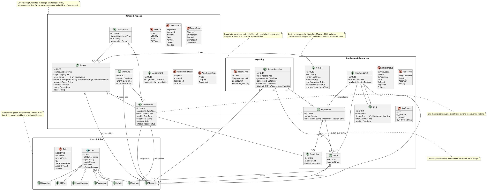

```plantuml
@startuml
hide methods
skinparam classAttributeIconSize 0
skinparam packageStyle rectangle

package "Users & Roles" as P_USERS {
  abstract class User {
    +id: UUID
    +fullName: String
    +login: String
    +email: String
    +role: Role
    +isActive: Boolean
  }

  class Mechanic
  class Foreman
  class Dispatcher
  class QCUser
  class ShopManager
  class Accountant
  class Admin

  enum Role {
    MECHANIC
    FOREMAN
    DISPATCHER
    QC
    SHOP_MANAGER
    ACCOUNTANT
    ADMIN
  }

  User <|-- Mechanic
  User <|-- Foreman
  User <|-- Dispatcher
  User <|-- QCUser
  User <|-- ShopManager
  User <|-- Accountant
  User <|-- Admin
}
note top of P_USERS
  Actors of the system. Role controls authorization.
  "isActive" enables soft blocking without deletion.
end note

package "Production & Resources" as P_RES {
  class Vehicle {
    +id: UUID
    +vin: String
    +orderNo: String
    +color: String
    +configuration: String
    +status: VehicleStatus
    +currentStage: StageType
  }

  enum VehicleStatus {
    InProduction
    InPaint
    InAssembly
    InQC
    InRepair
    Repaired
    Shipped
  }

  enum StageType {
    BodyAssembly
    Painting
    Assembly
    Testing
  }

  class RepairZone {
    +id: UUID
    +name: String
    +lineSection: String  // conveyor section label
  }

  class RepairBay {
    +id: UUID
    +number: Int
    +status: BayStatus
  }

  enum BayStatus {
    FREE
    OCCUPIED
    RESERVED
    OUT_OF_SERVICE
  }

  class Team {
    +id: UUID
    +name: String
  }

  class Shift {
    +id: UUID
    +date: Date
    +index: Int         // shift number in a day
    +startAt: DateTime
    +endAt: DateTime
  }

  class MechanicShift {
    +id: UUID
    +present: Boolean
    +availableForJobs: Boolean
  }

  RepairZone "1" o-- "1..6" RepairBay : bays
  Team "1" -- "1" Foreman : leader
  Team "1" o-- "1..*" Mechanic : members
  RepairZone "1" -- "1..*" Team : staffed-by (per shifts)
  Shift "1" -- "1..*" MechanicShift
  MechanicShift "*" -- "1" Mechanic
  MechanicShift "*" -- "1" Shift
  MechanicShift "*" -- "1" Team
  MechanicShift "*" -- "1" RepairZone : assigned zone
}
note top of P_RES
  Static resources and shift staffing. MechanicShift captures
  presence/availability per shift and links a mechanic to team & zone.
end note
note right of RepairBay
  Cardinality matches the requirement: each zone has 1..6 bays.
end note

package "Defects & Repairs" as P_DEF {
  class Defect {
    +id: UUID
    +createdAt: DateTime
    +stage: StageType
    +area: String            // unit/subsystem
    +locationOnDiagram: String  // coordinates/JSON on car schema
    +probableCause: String
    +severity: Severity
    +status: DefectStatus
    +notes: String
  }

  enum Severity {
    LOW
    MEDIUM
    HIGH
    CRITICAL
  }

  enum DefectStatus {
    Registered
    Assigned
    InRepair
    Fixed
    Verified
    Closed
    Rejected
  }

  class RepairOrder {
    +id: UUID
    +createdAt: DateTime
    +startAt: DateTime
    +endAt: DateTime
    +diagnosis: String
    +actions: String
    +status: RepairStatus
  }

  enum RepairStatus {
    Planned
    InProgress
    Paused
    Completed
    Cancelled
  }

  class WorkLog {
    +id: UUID
    +startAt: DateTime
    +endAt: DateTime
    +durationMin: Int
  }

  class Assignment {
    +id: UUID
    +assignedAt: DateTime
    +status: AssignmentStatus
  }

  enum AssignmentStatus {
    Assigned
    Accepted
    Reassigned
    Declined
  }

  class Attachment {
    +id: UUID
    +type: AttachmentType
    +uri: String
    +annotation: String
  }

  enum AttachmentType {
    Photo
    Diagram
    Document
  }

  Vehicle "1" -- "0..*" Defect : has >
  Defect "1" -- "1..*" RepairOrder : repair jobs >
  Defect "1" -- "1" Mechanic : registered-by

  RepairOrder "1" -- "0..1" Mechanic : assignedTo
  RepairOrder "1" -- "0..1" Foreman : assignedBy
  RepairOrder "1" -- "1" RepairZone
  RepairOrder "1" -- "1" RepairBay

  WorkLog "*" -- "1" Mechanic
  WorkLog "*" -- "1" RepairOrder

  Attachment "*" -- "0..1" Defect
  Attachment "*" -- "0..1" RepairOrder
}
note top of P_DEF
  Core flow: capture defect at a stage, create repair order,
  track execution time (WorkLog), assignments, and evidence (Attachment).
end note
note right of RepairOrder
  One RepairOrder occupies exactly one bay and zone over its lifetime.
end note

package "Reporting" as P_REP {
  class ReportSnapshot {
    +id: UUID
    +type: ReportType
    +generatedAt: DateTime
    +periodStart: DateTime
    +periodEnd: DateTime
    +payload: JSON  // aggregated metrics
  }
  enum ReportType {
    QCShift
    ShopManagerShift
    BrigadeShift
    AccountingMonthly
  }

  ReportSnapshot "0..*" -- "0..1" Team
  ReportSnapshot "0..*" -- "0..1" Mechanic
  ReportSnapshot "0..*" -- "0..1" RepairZone
}
note top of P_REP
  Snapshots materialize end-of-shift/month reports to decouple heavy
  analytics from OLTP and ensure reproducibility.
end note

@enduml
```
