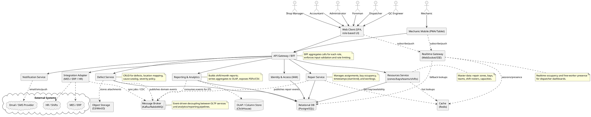

```plantuml
@startuml
skinparam componentStyle rectangle

actor "Mechanic" as A_Mech
actor "Foreman" as A_Fore
actor "Dispatcher" as A_Disp
actor "QC Engineer" as A_QC
actor "Shop Manager" as A_SM
actor "Accountant" as A_ACC
actor "Administrator" as A_Admin

component "Web Client (SPA,\nrole-based UI)" as C_Web
component "Mechanic Mobile (PWA/Tablet)" as C_Mobile

component "API Gateway / BFF" as C_API
component "Identity & Access (IAM)" as C_Auth
component "Defect Service" as C_Def
component "Repair Service" as C_Rep
component "Resources Service\n(zones/bays/teams/shifts)" as C_Res
component "Reporting & Analytics" as C_Reports
component "Notification Service" as C_Notify
component "Realtime Gateway\n(WebSocket/SSE)" as C_RT
component "Integration Adapter\n(MES / ERP / HR)" as C_Int

database "Relational DB\n(PostgreSQL)" as DB
queue "Message Broker\n(Kafka/RabbitMQ)" as MQ
component "Cache\n(Redis)" as Cache
folder "Object Storage\n(S3/MinIO)" as S3
database "OLAP / Column Store\n(ClickHouse)" as OLAP

cloud "External Systems" {
  cloud "MES / ERP" as EXT_MES
  cloud "HR / Shifts" as EXT_HR
  cloud "Email / SMS Provider" as EXT_SMS
}

' Users -> Clients
A_Mech --> C_Mobile
A_Fore --> C_Web
A_Disp --> C_Web
A_QC   --> C_Web
A_SM   --> C_Web
A_ACC  --> C_Web
A_Admin--> C_Web

' Clients -> API/Realtime
C_Web --> C_API
C_Mobile --> C_API
C_Web ..> C_RT : subscribe/push
C_Mobile ..> C_RT : subscribe/push

' API -> Domain services
C_API --> C_Auth
C_API --> C_Def
C_API --> C_Rep
C_API --> C_Res
C_API --> C_Reports
C_API --> C_Notify
C_API --> C_Int

' Service dependencies
C_Def --> DB
C_Def ..> MQ : publishes domain events
C_Def ..> S3 : stores attachments

C_Rep --> DB
C_Rep ..> MQ : publishes repair events
C_Rep ..> Cache : fast bay/availability

C_Res --> DB
C_Res ..> Cache : hot lookups

C_Reports --> DB
C_Reports ..> OLAP
C_Reports ..> MQ : consumes events for ETL

C_Notify ..> EXT_SMS : email/sms/push

C_RT ..> Cache : sessions/presence
C_RT ..> DB : fallback lookups

C_Int ..> EXT_MES
C_Int ..> EXT_HR
C_Int ..> MQ : sync jobs / CDC

C_Auth --> DB

' EXPLANATORY NOTES
note right of C_API
  BFF aggregates calls for each role,
  enforces input validation and rate limiting.
end note

note right of C_Def
  CRUD for defects, location mapping,
  cause catalog, severity policy.
end note

note right of C_Rep
  Manages assignments, bay occupancy,
  timestamps (start/end), and worklogs.
end note

note right of C_Res
  Master data: repair zones, bays,
  teams, shift rosters, capacities.
end note

note right of C_Reports
  Builds shift/month reports;
  writes aggregates to OLAP, exposes PDFs/CSV.
end note

note bottom of C_RT
  Realtime occupancy and free-worker presence
  for dispatcher dashboards.
end note

note right of MQ
  Event-driven decoupling between OLTP services
  and analytics/reporting pipelines.
end note
@enduml
```
