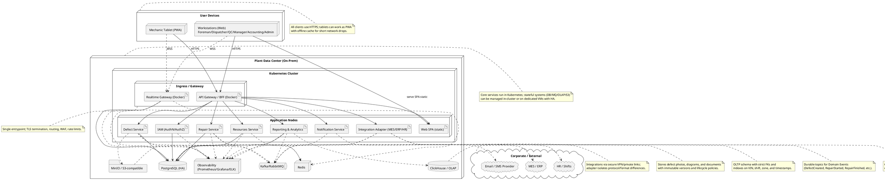

```plantuml
@startuml
skinparam componentStyle rectangle

node "User Devices" as N_UD {
  node "Mechanic Tablet (PWA)" as N_Tablet
  node "Workstations (Web)\nForeman/Dispatcher/QC/Manager/Accounting/Admin" as N_Desktops
}
note right of N_UD
  All clients use HTTPS; tablets can work as PWA
  with offline cache for short network drops.
end note

node "Plant Data Center (On-Prem)" as DC {
  node "Kubernetes Cluster" as K8s {
    node "Ingress / Gateway" as N_Ingress {
      artifact "API Gateway / BFF (Docker)" as A_API
      artifact "Realtime Gateway (Docker)" as A_RT
    }
    node "Application Nodes" as N_App {
      artifact "IAM (AuthN/AuthZ)" as A_Auth
      artifact "Defect Service" as A_Def
      artifact "Repair Service" as A_Rep
      artifact "Resources Service" as A_Res
      artifact "Reporting & Analytics" as A_RepRt
      artifact "Notification Service" as A_Notif
      artifact "Integration Adapter (MES/ERP/HR)" as A_Int
      artifact "Web SPA (static)" as A_Web
    }
  }

  database "PostgreSQL (HA)" as N_DB
  node "Redis" as N_Redis
  queue "Kafka/RabbitMQ" as N_MQ
  folder "MinIO / S3-compatible" as N_S3
  database "ClickHouse / OLAP" as N_OLAP
  node "Observability\n(Prometheus/Grafana/ELK)" as N_Obs
}
note right of DC
  Core services run in Kubernetes; stateful systems (DB/MQ/OLAP/S3)
  can be managed in-cluster or on dedicated VMs with HA.
end note

cloud "Corporate / External" as EXT {
  cloud "MES / ERP" as EXT_MES
  cloud "HR / Shifts" as EXT_HR
  cloud "Email / SMS Provider" as EXT_SMS
}
note right of EXT
  Integrations via secure VPN/private links;
  adapter isolates protocol/format differences.
end note

' User traffic
N_Tablet --> A_API : HTTPS
N_Tablet ..> A_RT : WSS
N_Desktops --> A_API : HTTPS
N_Desktops ..> A_RT : WSS
N_Desktops --> A_Web : serve SPA static

' Internal calls
A_API --> A_Auth
A_API --> A_Def
A_API --> A_Rep
A_API --> A_Res
A_API --> A_RepRt
A_API --> A_Notif
A_API --> A_Int
A_API --> A_Web

A_Def --> N_DB
A_Def ..> N_MQ
A_Def ..> N_S3

A_Rep --> N_DB
A_Rep ..> N_MQ
A_Rep ..> N_Redis

A_Res --> N_DB
A_Res ..> N_Redis

A_RepRt --> N_DB
A_RepRt ..> N_OLAP
A_RepRt ..> N_MQ

A_Auth --> N_DB
A_RT ..> N_Redis
A_RT --> N_DB

A_Notif ..> EXT_SMS
A_Int ..> EXT_MES
A_Int ..> EXT_HR
A_Int ..> N_MQ

' Observability
A_API ..> N_Obs
A_Def ..> N_Obs
A_Rep ..> N_Obs
A_Res ..> N_Obs
A_RepRt ..> N_Obs
A_Auth ..> N_Obs
A_RT ..> N_Obs
A_Int ..> N_Obs
A_Notif ..> N_Obs

' Explanatory notes
note bottom of N_Ingress
  Single entrypoint; TLS termination, routing, WAF, rate limits.
end note

note right of N_DB
  OLTP schema with strict FKs and
  indexes on VIN, shift, zone, and timestamps.
end note

note right of N_MQ
  Durable topics for Domain Events
  (DefectCreated, RepairStarted, RepairFinished, etc.).
end note

note right of N_OLAP
  Columnar store for shift/month aggregations;
  decouples analytics from OLTP load.
end note

note right of N_S3
  Stores defect photos, diagrams, and documents
  with immutable versions and lifecycle policies.
end note
@enduml
```
