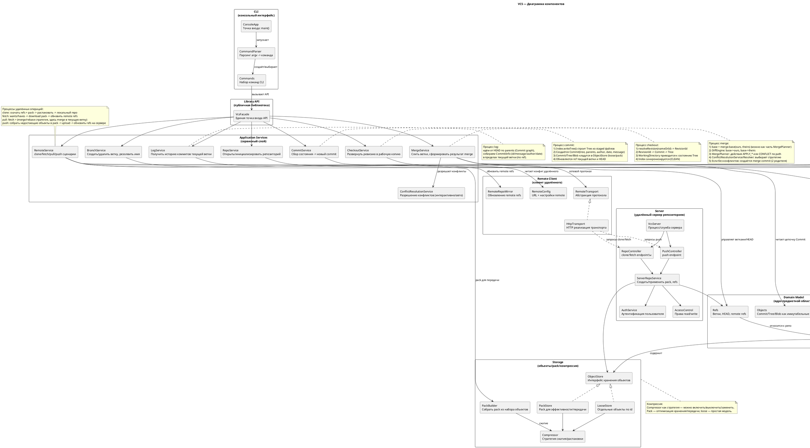
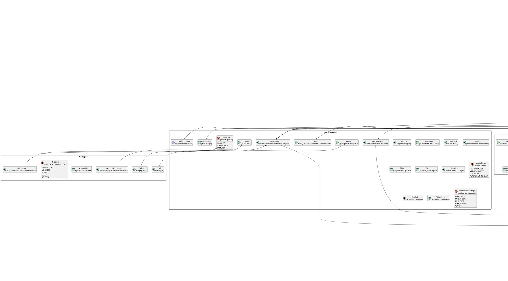

# Архитектура VCS

## Диаграммы

### Компоненты

```plantuml
@startuml
title VCS — Диаграмма компонентов
skinparam componentStyle rectangle
skinparam packageStyle rectangle
skinparam shadowing false

' =========================
' CLI (консоль)
' =========================
package "CLI\n(консольный интерфейс)" as CLI {
  [ConsoleApp\nТочка входа: main()] as ConsoleApp
  [CommandParser\nПарсинг argv -> команда] as Parser
  [Commands\nНабор команд CLI] as Commands
}

' =========================
' Library API (публичное API как библиотека)
' =========================
package "Library API\n(публичная библиотека)" as API {
  [VcsFacade\nЕдиная точка входа API] as Facade
}

' =========================
' Application Services (сценарии использования / use-cases)
' =========================
package "Application Services\n(сервисный слой)" as APP {
  [RepoService\nОткрыть/инициализировать репозиторий] as RepoSvc
  [CommitService\nСбор состояния -> новый commit] as CommitSvc
  [BranchService\nСоздать/удалить ветку, резолвить имя] as BranchSvc
  [CheckoutService\nРазвернуть ревизию в рабочую копию] as CheckoutSvc
  [LogService\nПолучить историю коммитов текущей ветки] as LogSvc
  [MergeService\nСлить ветки, сформировать результат merge] as MergeSvc
  [RemoteService\nclone/fetch/pull/push сценарии] as RemoteSvc
  [ConflictResolutionService\nРазрешение конфликтов (интерактивно/авто)] as CrSvc
}

' =========================
' Domain Model (ядро понятий VCS)
' =========================
package "Domain Model\n(ядро предметной области)" as DOMAIN {
  [Repository\nАгрегат: workdir/index/refs/objects] as Repo
  [Objects\nCommit/Tree/Blob как иммутабельные объекты] as Objects
  [Refs\nВетки, HEAD, remote refs] as Refs
  [Merge Model\nConflict/Resolution/MergeResult] as MergeModel
}

' =========================
' Workspace (жизненный цикл файлов)
' =========================
package "Workspace\n(рабочая копия и индекс)" as WS {
  [WorkingDirectory\nЧтение/запись файлов пользователя] as Workdir
  [Index\nStaging area: подготовка снимка] as Index
}

' =========================
' Storage (хранилище объектов + компрессия)
' =========================
package "Storage\n(объекты/pack/компрессия)" as ST {
  [ObjectStore\nИнтерфейс хранения объектов] as Store
  [LooseStore\nОтдельные объекты по id] as Loose
  [PackStore\nPack для эффективности/передачи] as Pack
  [Compressor\nСтратегия сжатия/распаковки] as Compressor
  [PackBuilder\nСобрать pack из набора объектов] as PackBuilder
}

' =========================
' Diff/Merge Engine (алгоритмы)
' =========================
package "Diff/Merge Engine\n(алгоритмы сравнения/слияния)" as DME {
  [DiffEngine\ndiff деревьев/файлов] as Diff
  [MergePlanner\nплан действий merge + конфликты] as Planner
}

' =========================
' Remote client
' =========================
package "Remote Client\n(клиент удалённого)" as RC {
  [RemoteTransport\nАбстракция протокола] as Transport
  [HttpTransport\nHTTP реализация транспорта] as Http
  [RemoteRepoMirror\nОбновление remote refs] as Mirror
  [RemoteConfig\nURL + настройки remote] as RCfg
}

' =========================
' Server side
' =========================
package "Server\n(удалённый сервер репозиториев)" as SRV {
  [VcsServer\nПроцесс/служба сервера] as Server
  [RepoController\nclone/fetch endpoint'ы] as RepoCtl
  [PushController\npush endpoint] as PushCtl
  [ServerRepoService\nСоздать/применить pack, refs] as SRepoSvc
  [AccessControl\nПрава read/write] as ACL
  [AuthService\nАутентификация пользователя] as Auth
}

' =========================
' Связи (зависимости)
' =========================
ConsoleApp --> Parser : запускает
Parser --> Commands : создаёт/выбирает
Commands --> Facade : вызывает API

Facade --> RepoSvc
Facade --> CommitSvc
Facade --> BranchSvc
Facade --> CheckoutSvc
Facade --> LogSvc
Facade --> MergeSvc
Facade --> RemoteSvc

RepoSvc --> Repo : создаёт/открывает
CommitSvc --> Repo : читает workdir/index, пишет objects/refs
BranchSvc --> Refs : управляет ветками/HEAD
CheckoutSvc --> WS : разворачивает Tree в workdir
LogSvc --> Objects : читает цепочку Commit
MergeSvc --> MergeModel : формирует MergeResult/Conflict
MergeSvc --> Diff : вычисляет изменения
MergeSvc --> Planner : планирует merge
MergeSvc --> CrSvc : разрешает конфликты

Repo --> Workdir : содержит
Repo --> Index : содержит
Repo --> Store : содержит
Refs --> Repo : относится к репо

Store <|.. Loose
Store <|.. Pack
Loose --> Compressor
Pack --> Compressor

RemoteSvc --> Transport : сетевой протокол
Transport <|.. Http
RemoteSvc --> PackBuilder : pack для передачи
PackBuilder --> Compressor : сжатие
RemoteSvc --> Mirror : обновить remote refs
RemoteSvc --> RCfg : читает конфиг удалённого

Http ..> RepoCtl : запросы clone/fetch
Http ..> PushCtl : запросы push

Server --> RepoCtl
Server --> PushCtl
RepoCtl --> SRepoSvc
PushCtl --> SRepoSvc
SRepoSvc --> Store
SRepoSvc --> Refs
SRepoSvc --> ACL
SRepoSvc --> Auth

' =========================
' Комментарии к процессам (как это работает)
' =========================
note right of CommitSvc
Процесс commit:
1) Index.writeTree() строит Tree из staged файлов
2) Создаётся Commit(tree, parents, author, date, message)
3) Commit/Tree/Blob кладутся в ObjectStore (loose/pack)
4) Обновляется ref текущей ветки и HEAD
end note

note right of CheckoutSvc
Процесс checkout:
1) resolveRevision(nameOrId) -> RevisionId
2) RevisionId -> Commit -> Tree
3) WorkingDirectory приводится к состоянию Tree
4) Index синхронизируется (CLEAN)
end note

note right of LogSvc
Процесс log:
идём от HEAD по parents (Commit graph),
собираем CommitInfo (id/message/author/date)
в пределах текущей ветки (по ref).
end note

note right of MergeSvc
Процесс merge:
1) base = merge-base(ours, theirs) (можно как часть MergePlanner)
2) DiffEngine: base->ours, base->theirs
3) MergePlanner: действия APPLY_* или CONFLICT по path
4) ConflictResolutionService/Resolver: выбирает стратегию
5) Если без конфликтов: создаётся merge commit (2 родителя)
end note

note top of RemoteSvc
Процессы удалённых операций:
clone: скачать refs + pack -> распаковать -> локальный repo
fetch: wants/haves -> download pack -> обновить remote refs
pull: fetch + (merge/rebase стратегия, здесь merge в текущую ветку)
push: собрать недостающие объекты в pack -> upload -> обновить refs на сервере
end note

note bottom of ST
Компрессия:
Compressor как стратегия — можно включить/выключить/заменить.
Pack — оптимизация хранения/передачи, loose — простая модель.
end note

note bottom of WS
Жизненный цикл файла в системе:
WorkingDirectory хранит текущее состояние пользователя,
Index — staged (подготовлено к коммиту),
Commit — иммутабельный снимок через Tree/Blob.
end note

@enduml
```

```plantuml
@startuml
title VCS — Class Diagram
skinparam packageStyle rectangle
skinparam shadowing false
hide empty members

' ======================
' CLI
' ======================
package "CLI" {
  class "ConsoleApp\n(точка входа CLI)" as ConsoleApp {
    +main(args)
  }

  class "CommandParser\n(парсит argv -> ICommand)" as CommandParser {
    +parse(args)
  }

  interface "ICommand\n(единый интерфейс команд)" as ICommand {
    +execute(ctx)
  }

  class "CommitCommand\n(CLI: commit)" as CommitCommand
  class "BranchCommand\n(CLI: branch)" as BranchCommand
  class "CheckoutCommand\n(CLI: checkout)" as CheckoutCommand
  class "LogCommand\n(CLI: log)" as LogCommand
  class "MergeCommand\n(CLI: merge)" as MergeCommand
  class "CloneCommand\n(CLI: clone)" as CloneCommand
  class "FetchCommand\n(CLI: fetch)" as FetchCommand
  class "PullCommand\n(CLI: pull)" as PullCommand
  class "PushCommand\n(CLI: push)" as PushCommand
}

ConsoleApp --> CommandParser : запускает
CommandParser --> ICommand : создаёт
ICommand <|.. CommitCommand
ICommand <|.. BranchCommand
ICommand <|.. CheckoutCommand
ICommand <|.. LogCommand
ICommand <|.. MergeCommand
ICommand <|.. CloneCommand
ICommand <|.. FetchCommand
ICommand <|.. PullCommand
ICommand <|.. PushCommand

' ======================
' Public API
' ======================
package "Public API" {
  class "VcsFacade\n(фасад библиотеки)" as VcsFacade {
    +open(path)
    +init(path)
    +commit(msg, author, dateUtc)
    +createBranch(name, startRev)
    +deleteBranch(name)
    +checkout(revOrBranch)
    +log(limit)
    +merge(branchName, resolver)
    +clone(url, path)
    +fetch(remote)
    +pull(remote, branch)
    +push(remote, branch)
  }

  class "RepositoryHandle\n(ссылка на repo + HEAD/ветка)" as RepositoryHandle {
    +path
    +head()
    +currentBranch()
  }

  class "AppContext\n(контекст выполнения команды)" as AppContext {
    +repo
    +io
  }

  interface "UserIO\n(ввод/вывод, консоль/тесты)" as UserIO {
    +print(text)
    +prompt(text)
    +choose(options)
  }

  class "CommitInfo\n(данные для log)" as CommitInfo {
    +id
    +message
    +author
    +dateUtc
  }
}

ICommand --> AppContext : получает ctx
ConsoleApp --> VcsFacade : вызывает API

' ======================
' Application Services
' ======================
package "Application Services" {
  class "RepoService\n(open/init репозитория)" as RepoService
  class "CommitService\n(делает commit)" as CommitService
  class "BranchService\n(ветки + resolve ревизий)" as BranchService
  class "CheckoutService\n(развёртывает ревизию)" as CheckoutService
  class "LogService\n(строит историю)" as LogService
  class "MergeService\n(слияние + конфликты)" as MergeService
  class "RemoteService\n(clone/fetch/pull/push)" as RemoteService
  class "ConflictResolutionService\n(решает конфликты)" as ConflictResolutionService
}

VcsFacade --> RepoService
VcsFacade --> CommitService
VcsFacade --> BranchService
VcsFacade --> CheckoutService
VcsFacade --> LogService
VcsFacade --> MergeService
VcsFacade --> RemoteService
MergeService --> ConflictResolutionService
ConflictResolutionService --> UserIO

' ======================
' Domain Model
' ======================
package "Domain Model" {
  class "Repository\n(агрегат: workdir/index/refs/objects)" as Repository
  class "RepoId\n(id репозитория)" as RepoId
  class "RevisionId\n(id ревизии: ветка/хеш)" as RevisionId
  class "CommitId\n(id коммита)" as CommitId
  class "ObjectId\n(id объекта)" as ObjectId

  abstract class "Object\n(база для Blob/Tree/Commit)" as Object
  class "Blob\n(содержимое файла)" as Blob
  class "Tree\n(снимок директории)" as Tree
  class "TreeEntry\n(путь+режим+objectId)" as TreeEntry
  enum "FileMode\n(режим файла)" as FileMode {
    REGULAR
    EXECUTABLE
    SYMLINK
  }

  class "Commit\n(метаданные + ссылки на tree/parents)" as Commit
  class "BranchRef\n(ветка: name -> target)" as BranchRef
  class "RefDatabase\n(refs: ветки/HEAD/remote)" as RefDatabase

  class "MergeResult\n(итог merge)" as MergeResult
  enum "MergeStatus\n(статус merge)" as MergeStatus {
    FAST_FORWARD
    MERGE_COMMIT
    CONFLICTS
    ALREADY_UP_TO_DATE
  }

  class "Conflict\n(конфликт по пути)" as Conflict
  interface "ConflictResolver\n(стратегия решения)" as ConflictResolver
  class "Resolution\n(решение конфликта)" as Resolution
  enum "ResolutionStrategy\n(выбор: ours/theirs/...)" as ResolutionStrategy {
    TAKE_OURS
    TAKE_THEIRS
    TAKE_BASE
    TAKE_MERGED
    ABORT
  }
}

RepoService --> Repository
CommitService --> Repository
BranchService --> RefDatabase
CheckoutService --> Repository
LogService --> Commit
MergeService --> ConflictResolver
MergeService --> MergeResult

' ======================
' Workspace
' ======================
package "Workspace" {
  class "WorkingDirectory\n(реальные файлы пользователя)" as WorkingDirectory
  class "Index\n(staging area)" as Index
  class "Path\n(тип пути)" as Path
  class "WorkingFile\n(файл + состояние)" as WorkingFile
  enum "FileState\n(UNTRACKED/MODIFIED/...)" as FileState {
    UNTRACKED
    MODIFIED
    STAGED
    CLEAN
    DELETED
  }
  class "IndexEntry\n(staged запись: path+mode+blobId)" as IndexEntry
}

Repository *-- WorkingDirectory
Repository *-- Index
IndexEntry --> FileMode
IndexEntry --> ObjectId
TreeEntry --> Path

' ======================
' Storage
' ======================
package "Storage" {
  interface "ObjectStore\n(хранилище объектов)" as ObjectStore
  class "LooseObjectStore\n(loose объекты по одному)" as LooseObjectStore
  class "PackObjectStore\n(pack хранение)" as PackObjectStore

  interface "Compressor\n(сжатие/распаковка)" as Compressor
  class "DefaultCompressor\n(реализация)" as DefaultCompressor

  class "PackBuilder\n(сборка pack)" as PackBuilder
  class "PackFile\n(контейнер объектов)" as PackFile
}

ObjectStore <|.. LooseObjectStore
ObjectStore <|.. PackObjectStore
Compressor <|.. DefaultCompressor
LooseObjectStore --> Compressor
PackObjectStore --> Compressor
PackBuilder --> Compressor
Repository --> ObjectStore

' ======================
' Diff/Merge Engine
' ======================
package "Diff/Merge Engine" {
  class "DiffEngine\n(diff деревьев/файлов)" as DiffEngine
  class "MergePlanner\n(план merge + конфликты)" as MergePlanner
  class "Change\n(изменение по пути)" as Change
  enum "ChangeKind\n(ADD/MODIFY/DELETE)" as ChangeKind {
    ADD
    MODIFY
    DELETE
  }
  class "MergeAction\n(действие merge по пути)" as MergeAction
  enum "MergeActionKind\n(APPLY/CONFLICT)" as MergeActionKind {
    APPLY_OURS
    APPLY_THEIRS
    CONFLICT
  }
}

MergeService --> DiffEngine
MergeService --> MergePlanner

' ======================
' Remote Client
' ======================
package "Remote Client" {
  class "RemoteConfig\n(name/url)" as RemoteConfig
  interface "RemoteTransport\n(handshake/negotiate/pack)" as RemoteTransport
  class "HttpTransport\n(HTTP реализация)" as HttpTransport
  class "Capabilities\n(возможности протокола)" as Capabilities
  class "NegotiationResult\n(missing objects)" as NegotiationResult
  class "PushResult\n(ok/reason)" as PushResult
  class "RemoteRepoMirror\n(обновить remote refs)" as RemoteRepoMirror
}

RemoteTransport <|.. HttpTransport
RemoteService --> RemoteTransport
RemoteService --> RemoteConfig
RemoteService --> PackBuilder
RemoteService --> RemoteRepoMirror

' ======================
' Server
' ======================
package "Server" {
  class "VcsServer\n(процесс сервера)" as VcsServer
  class "RepoController\n(HTTP: clone/fetch)" as RepoController
  class "PushController\n(HTTP: push)" as PushController
  class "ServerRepoService\n(pack/refs логика)" as ServerRepoService
  class "AccessControl\n(права)" as AccessControl
  class "AuthService\n(аутентификация)" as AuthService
  class "User\n(пользователь)" as User
}

VcsServer --> RepoController
VcsServer --> PushController
RepoController --> ServerRepoService
PushController --> ServerRepoService
ServerRepoService --> ObjectStore
ServerRepoService --> RefDatabase
ServerRepoService --> AccessControl
ServerRepoService --> AuthService
HttpTransport ..> RepoController : HTTP API
HttpTransport ..> PushController : HTTP API

' ======================
' Процессы (комментарии)
' ======================
note right of CommitService
Commit:
Index -> Tree -> Commit,
запись объектов в ObjectStore,
обновление RefDatabase (ветка/HEAD).
end note

note right of CheckoutService
Checkout:
resolveRevision -> Commit -> Tree,
развёртывание Tree в WorkingDirectory,
синхронизация Index.
end note

note right of MergeService
Merge:
DiffEngine + MergePlanner,
CONFLICT -> ConflictResolver,
успех -> merge commit (2 родителя) и сдвиг refs.
end note

note bottom of RemoteService
Remote:
fetch/pull: negotiate -> download pack -> ObjectStore.put -> обновить remote refs
push: собрать pack -> upload -> обновить refs на сервере
clone: refs + pack -> локальная сборка repo
end note

@enduml
```

